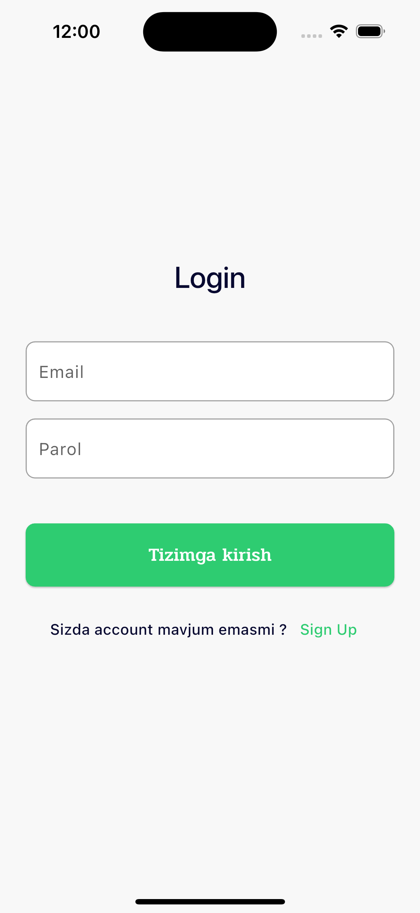
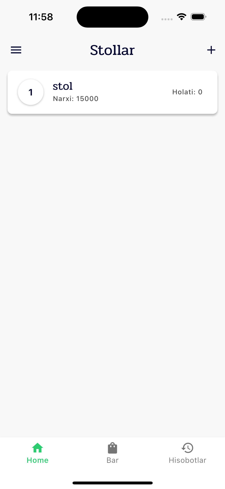
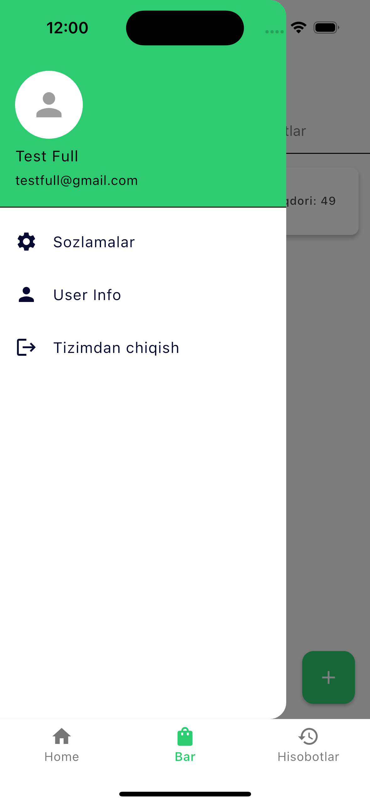
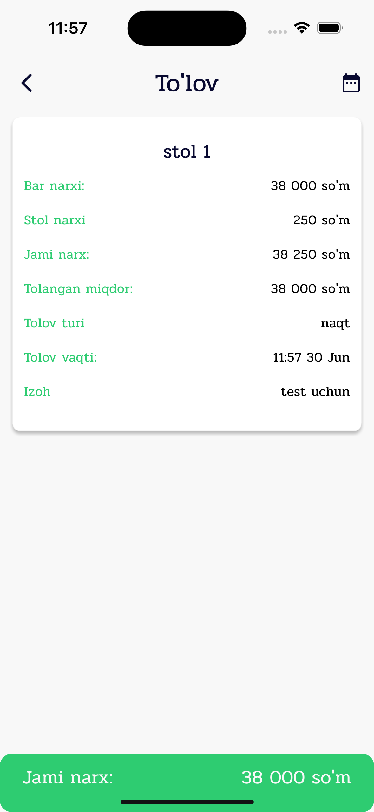

# ⏱ Timer Flow

**Timer Flow** — bu foydalanuvchilar uchun soddalashtirilgan va intuitiv interfeysga ega bo'lgan vaqt boshqaruv ilovasi.

## 📱 Skrinshotlar

|  |  |  | 

## ✨ Xususiyatlari

⏱ Stol uchun vaqtni ishga tushirish va to‘xtatish

🟢 Tennis va 🔵 Bilyard stollarini alohida boshqarish

🧮 Har bir stol bo‘yicha vaqt hisoboti va statistikasi

💾 O‘yinlar tarixi va ishlatilgan vaqtni saqlash

